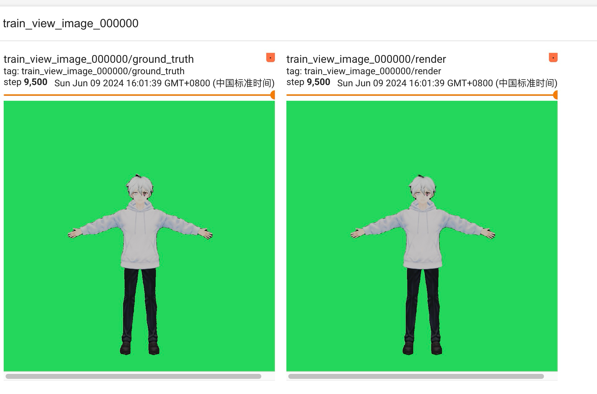
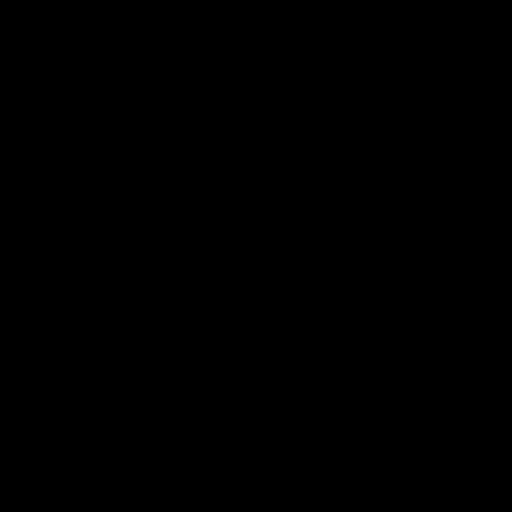
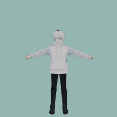

# Animatable Gaussian Avatar

Modeling animatable human avatars from only Few pictures.
colmap dataset is generally reconstructed in real video scenes.
Making data sets in the realm of virtual people is difficult.
This project mainly introduces how to do avatar related 3D reconstruction. Useing smpl models for animation

## High quality
It only takes a few minutes to recreate high-quality 3D models
<div>
  
</div>


## Animatable
We show avatars animated by challenging motions from [AMASS](https://amass.is.tue.mpg.de/) dataset.
<div>
  
  

</div>


## Installation

```
git clone --recursive https://github.com/heawon-yoon/anim-gaussian.git

cd anim-gaussian

conda create -n anim python=3.8 -y

conda activate anim

#torch and submodules
pip3 install torch torchvision torchaudio --index-url https://download.pytorch.org/whl/cu118
pip install submodules/diff-gaussian-rasterization
pip install submodules/simple-knn

pip install -r requirements.txt

```


# Preparing the datasets and models

## Datasets
- Download the SMPL neutral body model
    - Register to [SMPL](https://smpl.is.tue.mpg.de/index.html) website.
    - Download v1.1.0 file from the [download](https://smpl.is.tue.mpg.de/download.php) page.
    - Extract the files and rename `basicModel_neutral_lbs_10_207_0_v1.0.0.pkl` to `SMPL_NEUTRAL.pkl`.
    - Put the files into `./data/smpl/` folder with the following structure:

        ```
        data/smpl/
        ├── SMPL_NEUTRAL.pkl
        ```

- Download  dataset and pretrained models:
     - google link ([download](https://drive.google.com/file/d/1LLfmUnaWQxvge5y-4X51IbKa-ZqdWLIQ/view?usp=sharing))
     - baidu link ([download](https://pan.baidu.com/s/14rvfQQaYHWpoved1cpsd9w?pwd=2tqp))


- Download AMASS dataset for novel animation rendering:
  - AMASS dataset is used for rendering novel poses.
  - We used SFU mocap(SMPL+H G) and MPI_mosh (SMPL+H G) subsets, please download from [AMASS](https://amass.is.tue.mpg.de/download.php).
  - Put the downloaded mocap data in to `./data/` folder.

After following the above steps, you should obtain a folder structure similar to this:

```
data/
├── smpl
│   ├── SMPL_FEMALE.pkl
│   ├── SMPL_MALE.pkl
│   ├── SMPL_NEUTRAL.pkl
├── humans
│   ├── blender
│   ├── mask
│   ├── cameras.json
│   ├── point_cloud.ply
├── MPI_mosh
│   ├── 00008
│   ├── 00031
│   ├── ...
│   └── 50027
└── SFU
    ├── 0005
    ├── 0007
    ├── ...
    └── 0018
```


# Evaluation and Animation


```
python render_around.py -o <<path to the output directory>>
```

This command will generate 360 degree rotation video and animation video


# Training

```
python train.py -s data/humans -o output/0001
#useing tensorboard to check training result
tensorboard --logdir=./output/0001
```
Open this URL in your browser 
tensorboard_url : http://localhost:6006/


# Custom Dataset

  I used the vroid software to generate the avatar model.
  To generate your own dataset, refer to the blender.py file.
  Open blender app and paste the above code from the script menu

  1. blender.py will generate Multi-view images and cameras.json file
  
  2. generate mask files Please refer to [SAM](https://github.com/facebookresearch/segment-anything.git),
  sam.py is just simple example code. Please modify the code according to your needs


# License
The model is licensed under the [Apache 2.0 license](LICENSE).